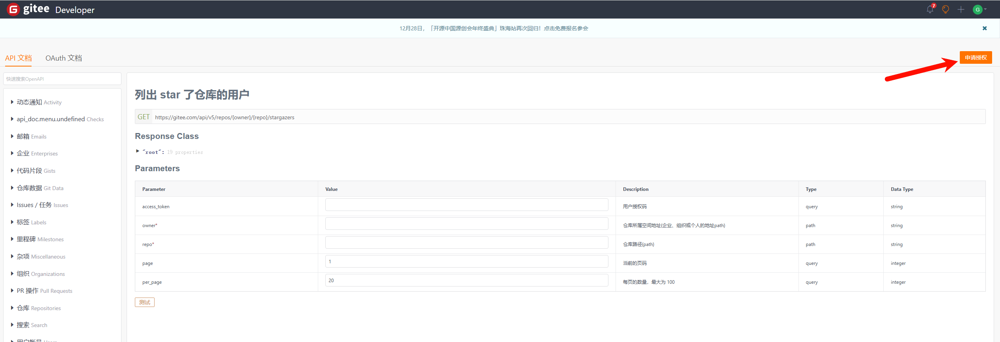
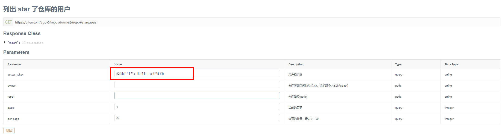

## 数据统计

用于统计github与gitee数据

### 本地开发

本地开发需要申请两个token

_gitee的token:_

1、首先打开gitee开发者页面：https://gitee.com/api/v5/swagger#/getV5ReposOwnerRepoStargazers?ex=no
2、点击申请授权，登录gitee后点击同意授权

3、同意授权后，就会得到一个token。这个token就可以用于获取gitee仓库相关的信息


_github的token:_


获取完两个token后:
```
TOKEN={GITHUB_TOKEN} GITEE_TOKEN={GITEE_TOKEN} pnpm stat

// 如果是powershell或者cmd 则需要加一个set前缀
set TOKEN={GITHUB_TOKEN} GITEE_TOKEN={GITEE_TOKEN} pnpm stat
```